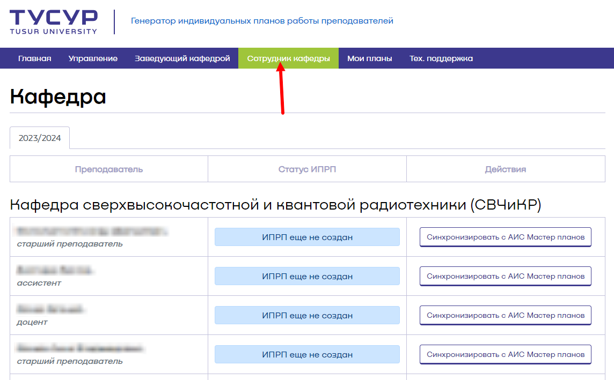
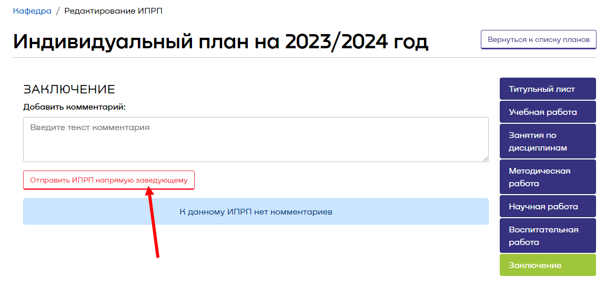
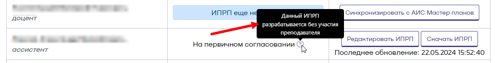

# Оглавление
[Описание](#Описание)
[Раздел сотрудника кафедры](#Раздел%20сотрудника%20кафедры)
[Создание ИПРП](#Создание%20ИПРП)
[Первичное заполнение ИПРП](#Первичное%20заполнение%20ИПРП)
[Первичное согласование ИПРП](#Первичное%20согласование%20ИПРП)
[Промежуточное заполнение ИПРП](#Промежуточное%20заполнение%20ИПРП)
[Промежуточное согласование ИПРП](#Промежуточное%20согласование%20ИПРП)
[Финальное заполнение ИПРП](#Финальное%20заполнение%20ИПРП)
[Финальное согласование ИПРП](#Финальное%20согласование%20ИПРП)
# Описание

[Генератор индивидуальных планов работы преподавателя (ИПРП)](https://ppsworkplan.tusur.ru/) предназначен для создания, заполнения и согласования ИПРП, а также мониторинга и статистики этих процессов.

# Раздел сотрудника кафедры

Раздел сотрудника кафедры открывается нажатием соответствующей кнопки в генераторе. При этом откроется страница, содержащая все ИПРП кафедры в различных статусах с возможностью создать ИПРП любому из преподавателей (рисунок 1).

*Рисунок 1 - Раздел генератора "Сотрудник кафедры"*

# Создание ИПРП

Для создания ИПРП необходимо нажать кнопку "Синхронизировать с АИС Мастер планов" напротив соответствующего преподавателя. В случае, если у преподавателя не будет учебной нагрузки, то система сообщит об этом и спросит, нужно ли создавать ИПРП без учебной нагрузки (рисунок 2).

*Рисунок 2 - Сообщение об отсутствии учебной нагрузки у преподавателя*

Если вы уверены, что у преподавателя должна быть учебная нагрузка, то необходимо нажать кнопку "Отмена" и обратиться к заведующему кафедрой для уточнения распределения нагрузки. Когда нагрузку добавят в АИС Мастер планов, необходимо будет повторить попытку создания ИПРП. Если же у этого преподавателя не должно быть нагрузки, то нажмите "Создать ИПРП" для его создания.
В случае, если у преподавателя имеется нагрузка из АИС Мастер планов, система успешно создаст ИПРП, а его статус сменится на "Создан" (рисунок 3).

*Рисунок 3 - Успешно созданный ИПРП*

# Первичное заполнение ИПРП
Первичное заполнение ИПРП осуществляется по алгоритму в соответствии с  [ инструкцией преподавателя](Пользовательские%20инструкции/Инструкция%20преподавателя.md#первичное-заполнение-ипрп).
**В разделе "Заключение" ИПРП вместо кнопки "Отправить на согласование" у сотрудника кафедры имеется кнопка "Отправить ИПРП напрямую заведующему". Данной функцией необходимо пользоваться только в том случае, если преподаватель не участвует в процедуре согласования своего ИПРП, а у заведующего кафедрой имеется доверенность на подписание ИПРП такого преподавателя.** 
# Первичное согласование ИПРП

Если дальнейшее согласование ИПРП предполагает участие преподавателя, то после заполнения ИПРП необходимо сообщить ему, что ИПРП создан и заполнен, и что он может проверять и отправлять его на согласование заведующему кафедрой. На этом этапе работа сотрудника кафедры с ИПРП завершается.
Если участие преподавателя не предполагается, то для отправки на согласование в разделе "Заключение" после заполнения ИПРП необходимо нажать "Отправить ИПРП напрямую заведующему" (рисунок 4).

*Рисунок 4 - Отправка ИПРП на согласование*

При успешной отправке на согласование откроется страница сотрудника кафедры, а ИПРП перейдет в статус "На первичном согласовании" с отметкой о том, что ИПРП был создан без участия преподавателя (рисунок 5).

*Рисунок 5 - Смена статуса ИПРП*

Дальнейшая процедура согласования ИПРП осуществляется в соответствии с [инструкцией](Пользовательские%20инструкции/Инструкция%20преподавателя.md#первичное-согласование-ИПРП).

# Промежуточное заполнение ИПРП

Промежуточное заполнение ИПРП осуществляется в соответствии с [инструкцией](Пользовательские%20инструкции/Инструкция%20преподавателя.md#промежуточное-заполнение-ипрп). Единственное отличие в том, что не появляется сообщение о превышении нормы суммарной нагрузки, а также то, что отправка на согласование осуществляется кнопкой "Отправить ИПРП напрямую заведующему".
# Промежуточное согласование ИПРП

Промежуточное согласование ИПРП осуществляется аналогично первичному согласованию.

# Финальное заполнение ИПРП

Финальное заполнение ИПРП осуществляется в соответствии с [инструкцией](Пользовательские%20инструкции/Инструкция%20преподавателя.md#финальное-заполнение-ипрп).
# Финальное согласование ИПРП

Процедура финального согласования соответствует процедуре промежуточного согласования. После финального согласования ИПРП заведующим кафедрой ИПРП переходит в статус "Финально согласован" и более не доступен для редактирования.